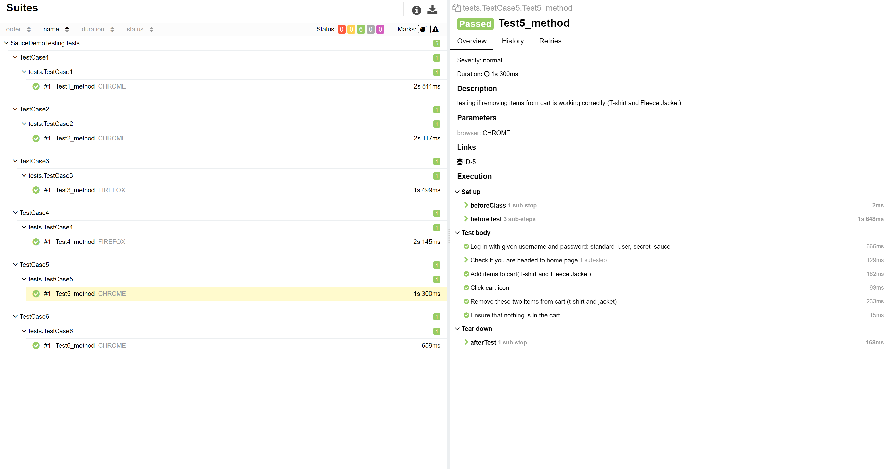
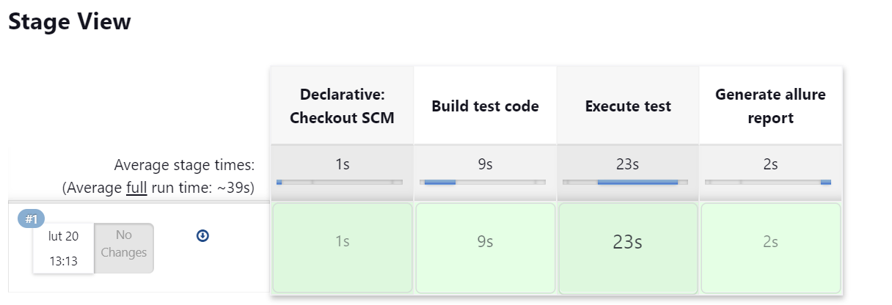
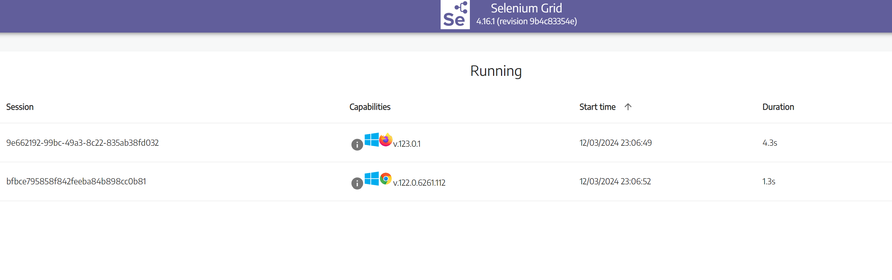

# SauceDemoTesting

This project is about testing GUI of website
[saucedemo.com](https://www.saucedemo.com/)

I have written 5 example test cases to show my skills of GUI testing. Each test case has steps to perform. My job was to automate those using tech stack given below

## Tech Stack

*Programming language:* Java

*Build Automation Tool:* Maven

*Frameworks for tests:* Selenium, TestNG

*Framework for reports:* Allure

*Other:* Jenkins, Selenium Grid


## To run test cases:

with maven command:
            
    mvn clean test

with running xml file:

    src/test/resources/test_suites.xml

## Test Cases
Test cases description and steps can be found in a file:

    ListOfTestCases

Java implementation of these test cases can be found in:

    src/test/java/tests


## POP

Project uses POP (Page Object Pattern) and these objects can be found in:
           
    src/tests/java/page/objects


## Allure Report

to generate report:
````
mvn allure:install
````
````            
mvn allure:report
````

Generated report can be found in Your:
````
target/site/index.html
````



## Jenkins Pipeline
Test cases were run on jenkins pipeline




## Selenium Grid
Test cases were run using Selenium Grid

